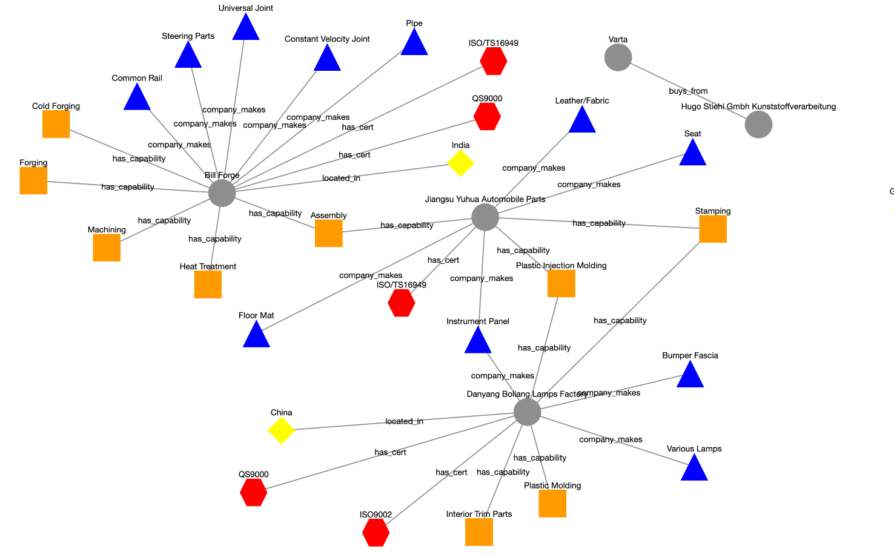

# Link Prediction in Supply Chain Networks

Repo containing MPhil thesis code for link prediction in supply chain knowledge graphs using Graph Representation Learning.


## Getting started
You can get started with recreating the GNN analysis by running
`pip install -r requirements.txt` followed by running the training and testing scripts with:
`python3 main.py --cpu` (alternatively `--gpu` if you are lucky enough to have one 🌝)

## Supply Chain Networks as Knowledge Graphs
Modern supply chains lend themselves to a KG representation based on rich metadata regarding their 
certifications, location, buying and selling relationships, and capabilities. A KG representation allows for
companies to interrogate their supply chains in a novel way. Examples including finding alternative suppliers, building relationships
(or removing relationships in nefarious instances). The following image is an extrac of 
the KG built for an automotive suppply chain.  



The ontology of the graph is given as:

Nodes | Number
------------ | -------------
company (e.g. General Motors)| 119,599
product (e.g. Floor mat) | 119,618
capability (e.g. Machining) | 36
certification (e.g. ISO9001) | 9

Edges in the ontology

Edges | Number
------------ | -------------
('capability', 'capability_produces', 'product') | 21,857
('company', 'buys_from', 'company') | 88,997
('company', 'has_capability', 'capability') |  83,787
('company', 'has_cert', 'certification') | 32,654
('company', 'located_in', 'country') | 40,421
('company', 'makes_product', 'product')| 119,618
('product', 'complimentary_product_to', 'product') | 260,658

## Citing Our Work

If you find this implementation useful, please consider citing the following article.

```
@article{
author = {Aziz, Ajmal and Kosasih, Edward and Griffiths, Ryan-Rhys and Brintrup, Alexandra},
journal = {International Conference for Machine Learning (ICML) workshop on ML4Data},
year = {2021},
month = {07},
title = {Data Considerations in Graph Representation Learning for Supply Chain Networks}
}
```

## Solution Filestructure - Multiclass classification Graph Neural Network (DGL)

The file structure is laid out as follows:

```bash
├── README.md                                   # The top-level README
├── config                                      # 🏃🏻 Run Project configurations
│   ├── config.yml                              # For changing run parameters (e.g. number of epochs 🌝)
│   └── sweep_config.yml
├── data                                        # 👀 Ask for GDrive Access
│   ├── 01_raw                                  # 💾 Data from third party sources.
│   │   ├── raw_df.pkl
│   │   └── supplier_product_df.parquet
│   ├── 02_intermediate                         # 💪🏼 Intermediate data that has been transformed.
│   │   ├── G.pickle
│   │   ├── bG.pickle
│   │   ├── cG.pickle
│   │   ├── dataset
│   │   ├── dataset.pickle
│   │   ├── marklinesEdges.p
│   ├── 03_models                               # Saved GNN models 
│   └── 04_results                              # Results from the analysis 🚀
├── images
│   └── kg_extract.png
├── main.py
├── notebooks                                   # 👨🏻‍💻 Exploratory notebooks
│   ├── 1_analyse_dgl_creation.ipynb
│   ├── 2_parameter_sweep-Copy1.ipynb
├── requirements.txt
└── src
    ├── __init__.py
    ├── common
    │   └── formats.py
    ├── exploration                             # 🎣 Exploring data (e.g. degree distributions)
    │   ├── Marklines.py
    │   ├── __init__.py
    │   ├── dataset.py
    │   ├── visualise_graph.py
    │   └── visualise_knowledge_graph.py
    ├── ingestion                               # Data loaders and utils for torch 🔥
    │   ├── __init__.py
    │   ├── dataloader.py
    │   ├── dataset.py
    │   ├── dgl_dataset.py
    │   └── utils.py
    ├── managers                                # Training and testing managers in torch 🔥
    │   ├── evaluator.py
    │   └── trainer.py
    ├── model                                   # 🤖 DGL Models 
    │   ├── __init__.py
    │   └── dgl
    │       ├── StochasticRGCN.py
    │       ├── __init__.py
    │       ├── __pycache__
    │       │   ├── StochasticRGCN.cpython-39.pyc
    │       │   ├── __init__.cpython-39.pyc
    │       │   └── layers.cpython-39.pyc
    │       └── layers.py
```
